

# nosDshell

### deepin 15 的形 · Noctalia 的神 · Wayland 的骨

**经典 DDE 桌面在现代 Wayland 上的完整重生——不是致敬，是像素级还原。**

[English](README_EN.md) · [Wiki 文档](https://shinebreaker.github.io/nosDshell/) · [设计规范](DESIGN.md) · [更新日志](CHANGELOG.md)

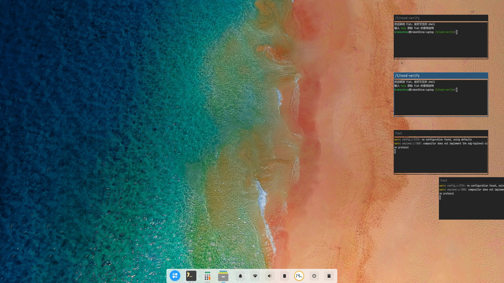

---

## 为什么是 nosDshell？

Noctalia 是当下最完整的 Quickshell 桌面 shell 之一；deepin 15（DDE 15）是国产桌面美学的一座高峰。nosDshell 做的事只有一件：**让 Noctalia v4 的全部能力，以 DDE 15 的方式呈现**。

- **像素级复刻，不是凭印象致敬** — 每一个尺寸、透明度、圆角、动效时长都从 [GXDE-OS](https://github.com/GXDE-OS)（DDE 15 社区维护版）源码中提取，规范成文于 [`DESIGN.md`](DESIGN.md)。
- **Noctalia v4 全功能内核** — 业务层原样继承：Niri / Hyprland / Sway / Scroll / Labwc / MangoWC 六合成器、多显示器、壁纸管线、桌面挂件、插件体系、设置迁移。砍掉的上游能力只有遥测、版本检查和赞助者服务这类 noctalia 身份组件。
- **亮 / 暗双主题，图标跟着面墨走** — 玻璃面随主题切换，单色图标与 `*-symbolic` 素材自动反色：亮面深墨、暗面亮墨；壁纸面（全屏启动器、锁屏、会话菜单）在任何主题下都保持深色压底，白字白图永不发灰。
- **双形态任务栏** — 高效通栏与时尚悬浮 dock 一键切换，四向停靠；DDE 式箭头气泡弹出层锚定在触发的任务栏图标上。
- **两种启动器** — DDE 式全屏网格（模糊壁纸、任务栏仍可交互）+ 迷你启动器（两级分类浏览、应用 / 命令 / 计算搜索）。
- **右缘控制中心** — 408 px 毛玻璃框架、15 模块宫格、快捷开关分页、通知历史；设置页内嵌其中，56 px 导航轨复刻原版。

---

## 主题自适应 · 双主题实拍

| 亮 / Light | 暗 / Dark |
|:---:|:---:|
|  | 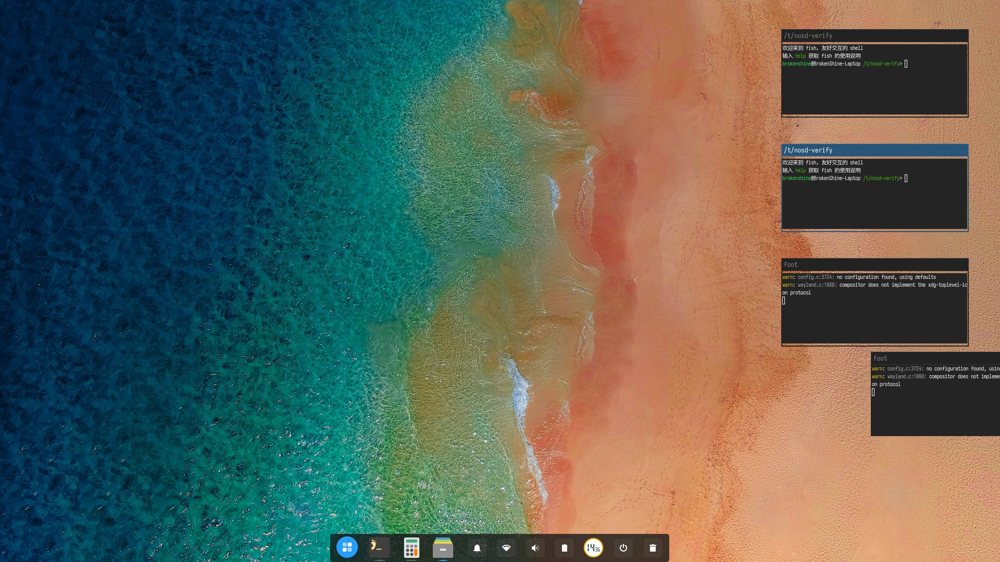 |
| 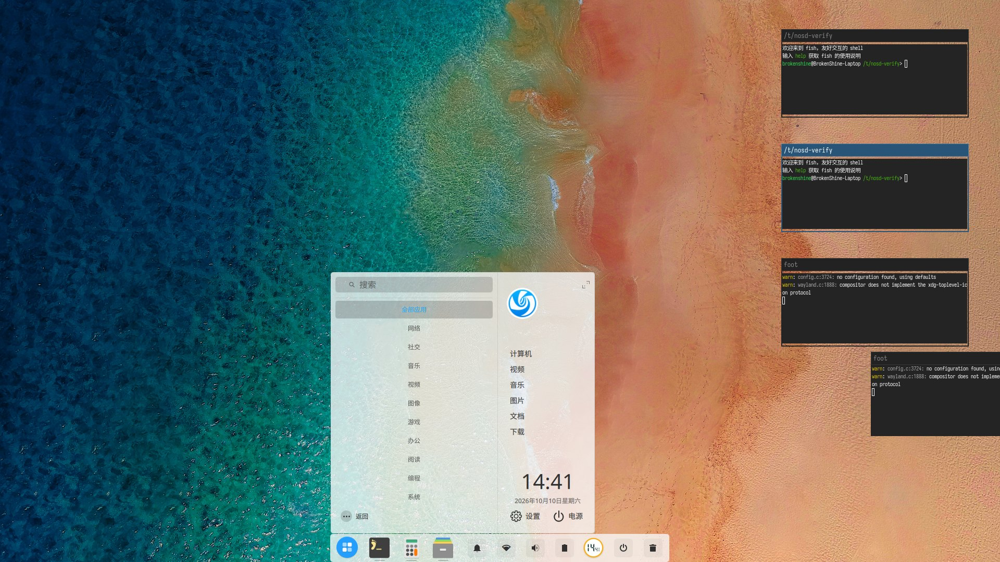 | 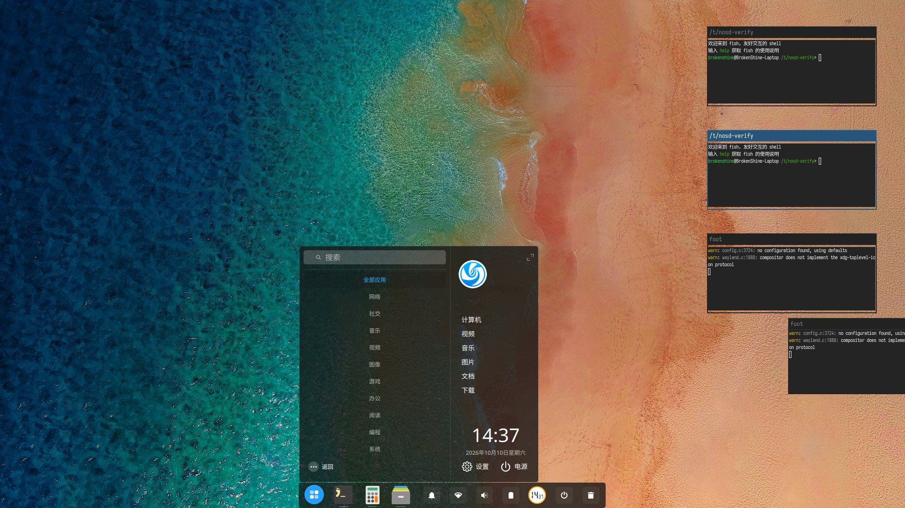 |
| 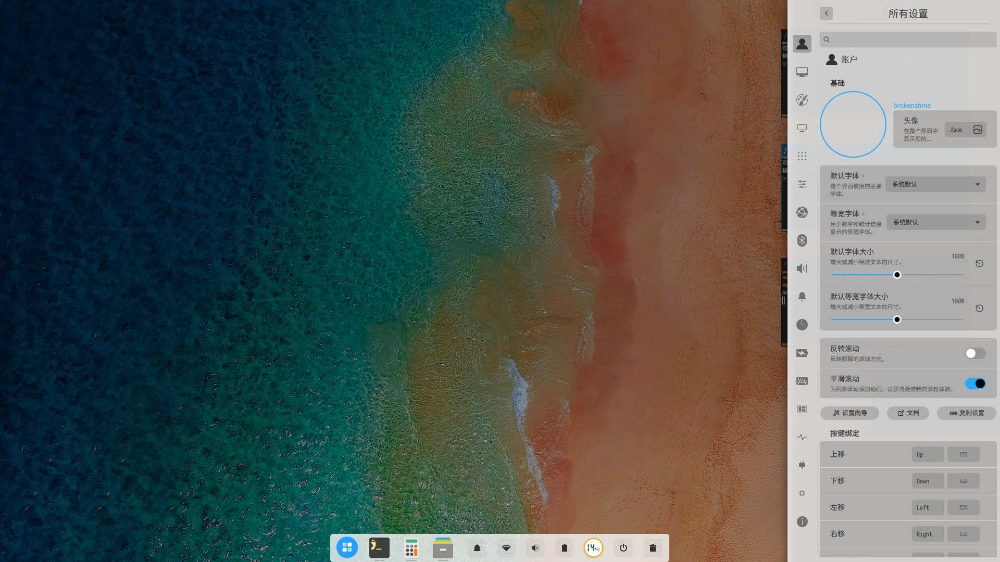 | 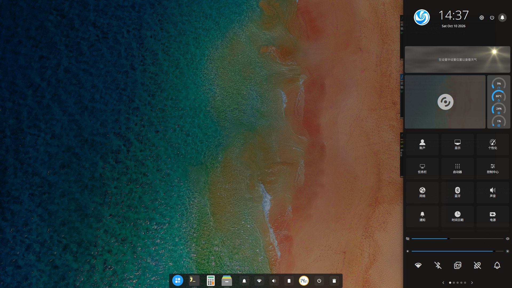 |

<b>更多界面 / More screenshots</b>

| | |
|:---:|:---:|
| **全屏启动器**（壁纸面保持暗色） | **高效模式任务栏** |
| 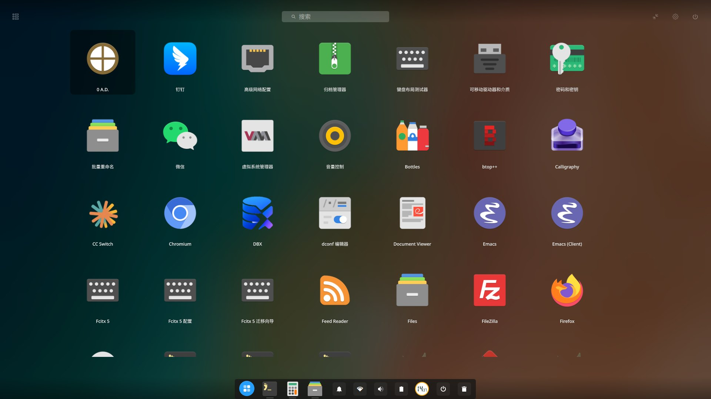 | 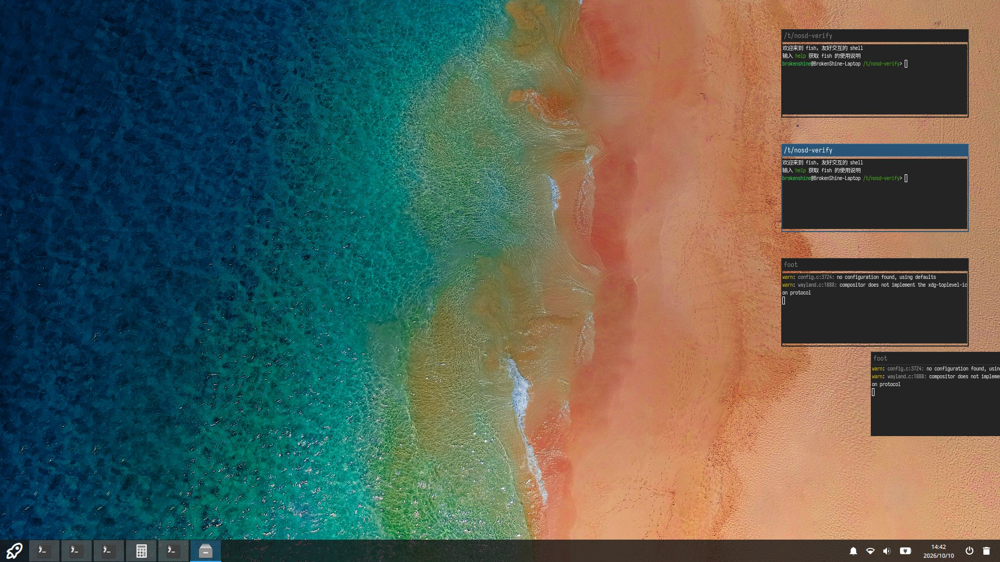 |
| **dock 信息面板** | **控制中心（亮色）** |
| 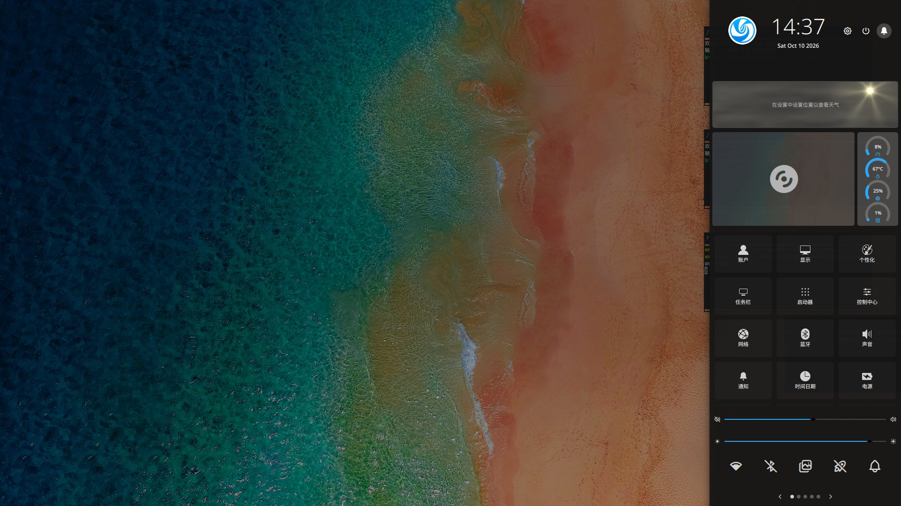 | 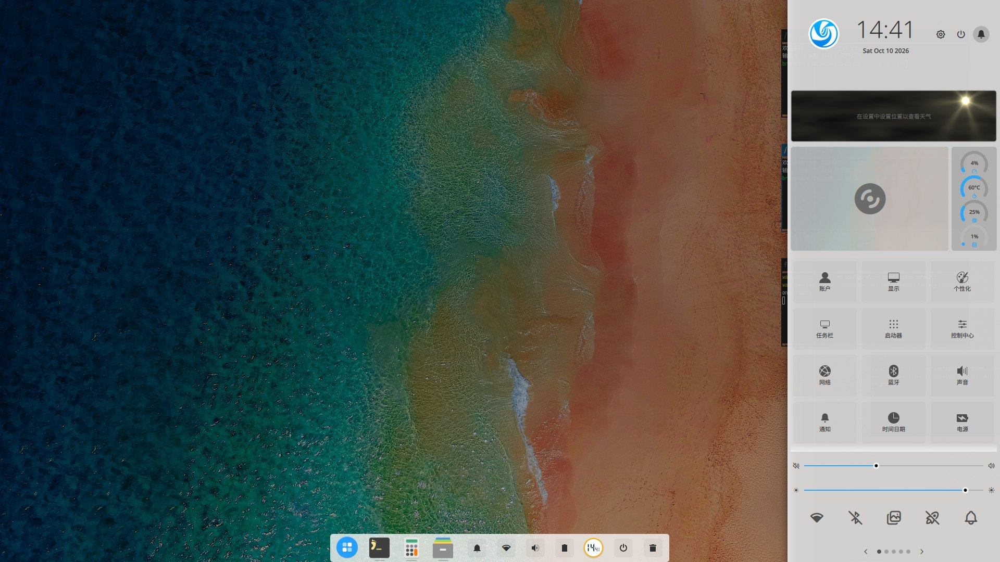 |
| **通知** | **OSD** |
| 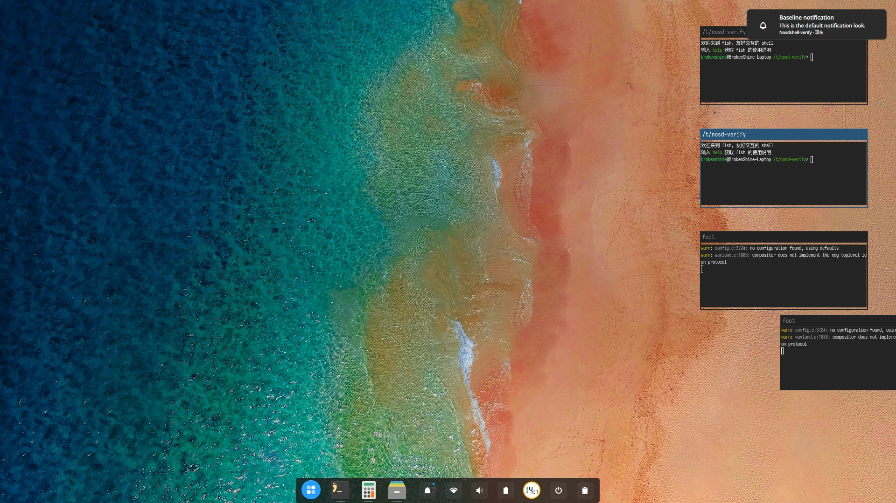 | 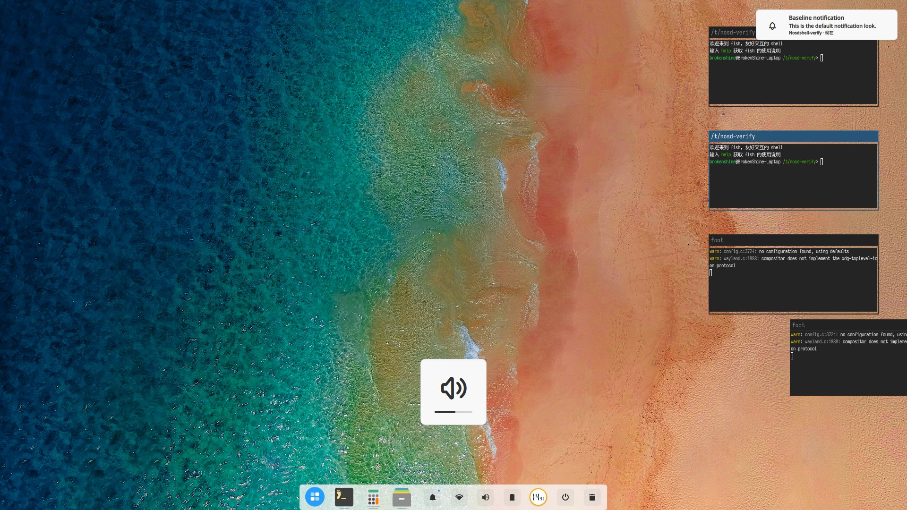 |
| **会话菜单** | **锁屏** |
| 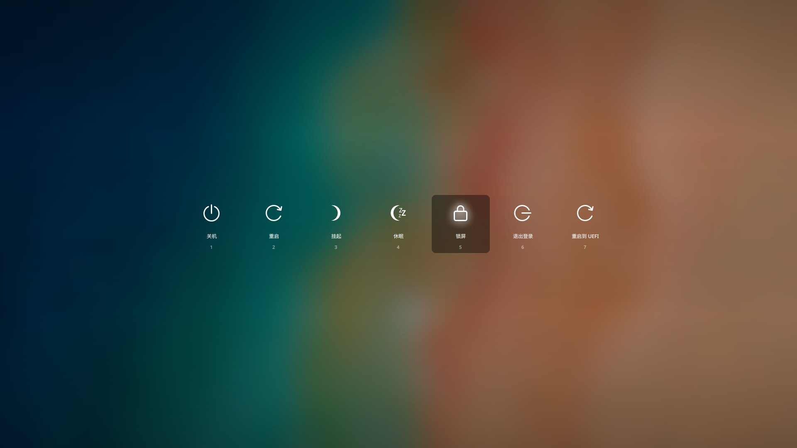 | 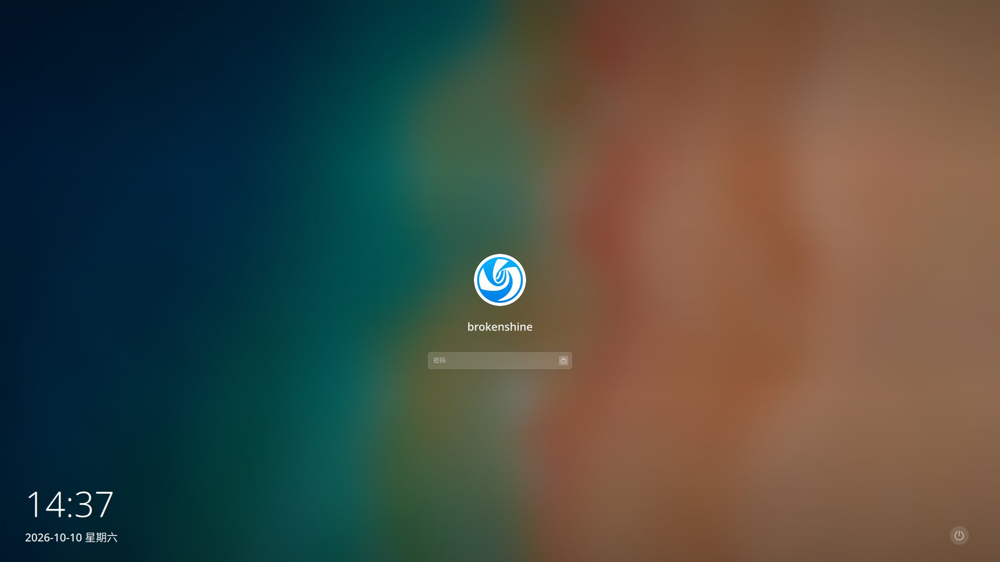 |

---

## 界面构成

- **任务栏**：高效（通栏）/ 时尚（悬浮 dock）双形态，四个停靠方向；运行中应用指示条、分组、置顶、拖拽排序按 DDE 语义实现。
- **启动器**：全屏模式保留任务栏可交互；迷你模式支持两级分类（再点分类回"全部"）、搜索、命令与计算。
- **控制中心**：15 模块宫格 + 快捷开关分页 + 通知历史；点击模块直达设置页。
- **会话菜单**：居中 140×140 按钮排（关机 / 重启 / 挂起 / 休眠 / 锁屏 / 退出登录），数字键快捷选择。
- **OSD**：底部居中气泡，音量 / 亮度 / 过载；显示期间连续调节就地刷新数值，不重播动画。
- **通知与 Toast**：300 px 气泡逐条排队；`*-symbolic` 应用图标按面墨着色。
- **锁屏**：底部信息带（时钟、日期、媒体与电源控制）+ 居中认证区（头像、密码框、错误气泡、Caps Lock 提示）。

---

## 运行要求

- Wayland 合成器：Niri / Hyprland / Sway / Scroll / Labwc / MangoWC
- [Quickshell](https://quickshell.outfoxxed.me)（上游 0.3.x；音频频谱由 cava 子进程提供）
- 图标主题推荐 Papirus 或 deepin

| 发行版 | 方式 |
|---|---|
| Guix | 仓库根部 `nosdshell.scm` |
| Nix / NixOS | `flake.nix`（含 home-manager / NixOS 模块） |
| 其他 | 把本仓库放到 Quickshell 配置目录，`qs -p <仓库>` 启动 |

---

## 文档

- **[Wiki](https://shinebreaker.github.io/nosDshell/)** — 含上游 Noctalia v4 wiki 的完整存档镜像（安装、配置、主题、插件开发、IPC 参考）
- [`DESIGN.md`](DESIGN.md) — DDE 15 视觉与交互规范（唯一设计依据）
- [`AGENTS.md`](AGENTS.md) / [`CODING_STANDARDS.md`](CODING_STANDARDS.md) / [`DEBUGGING.md`](DEBUGGING.md) — 工程约束
- [`CHANGELOG.md`](CHANGELOG.md) · [`docs/RELEASE.md`](docs/RELEASE.md) — 变更与发版流程

---

## 开发

| 目的 | 命令 |
|---|---|
| 静态检查 | `Scripts/dev/lint.sh [--changed]` |
| 隔离环境运行并截图 | `Scripts/test/verify.sh <名字> [--settings seed.json] [--scenes a,b]` |
| 真 niri 路径验证 | `Scripts/test/niri/`（嵌套 niri，桌面上会开一个窗口） |
| 性能基线 | `Scripts/test/bench.sh` |
| 格式化 QML | `Scripts/dev/qmlfmt.sh <路径>` |

---

## 许可

GPL-3.0 License — 见 [LICENSE](LICENSE)。
源自上游 Noctalia 的部分仍按 MIT License 分发 — 见 [LICENSE-MIT](LICENSE-MIT)。

## 致谢

- [Noctalia](https://github.com/noctalia-dev/noctalia-shell) — 本项目的功能基础（v4 分支）；其 v4 文档存档镜像托管于本站 Wiki。
- [GXDE-OS](https://github.com/GXDE-OS) — DDE 15 的社区维护版，全部设计数值的来源；默认壁纸 `deepin15-desktop.jpg` 取自其壁纸仓（CC-BY-3.0 © UnionTech）。
- deepin / DDE 15 — 这套视觉语言的原创者。
