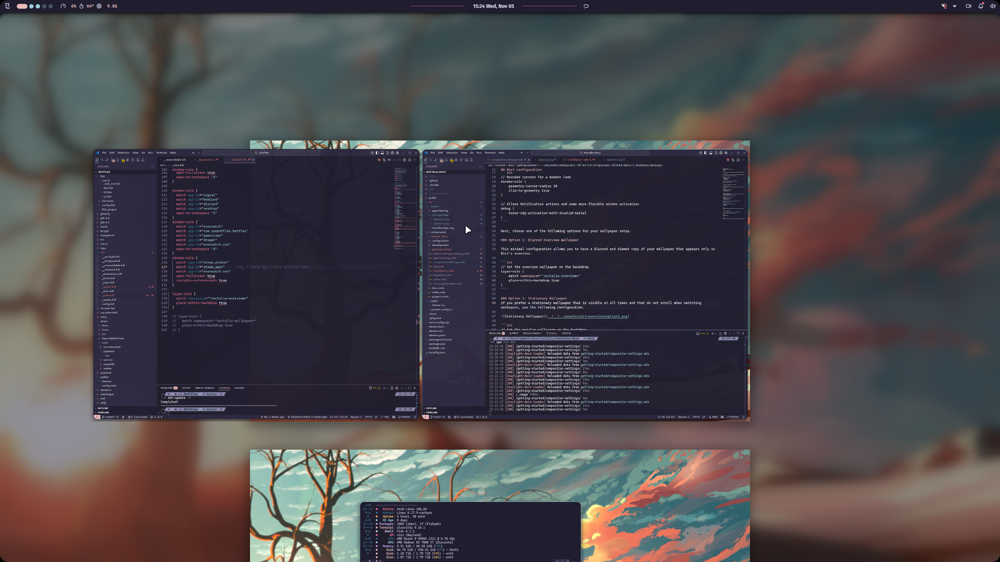
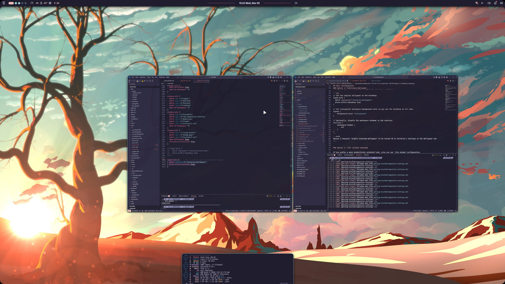
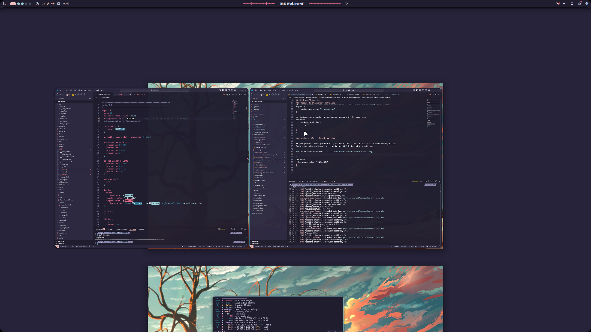

<!-- generated by Scripts/docs/vendor-legacy-docs.py; do not hand-edit -->


Add the following settings to your Niri configuration file (usually located at `~/.config/niri/config.kdl`).

These settings are for general window appearance and functionality.

```ini
window-rule {
  // Rounded corners for a modern look.
  geometry-corner-radius 20

  // Clips window contents to the rounded corner boundaries.
  clip-to-geometry true
}

debug {
  // Allows notification actions and window activation from Noctalia.
  honor-xdg-activation-with-invalid-serial
}
```

## Wallpapers setup

Next, choose one of the following options for your wallpaper and overview setup.

> **Note**
> The "backdrop" in Niri is a layer behind all workspaces that is visible when you trigger the overview mode.


### Option 1: Blurred Overview Wallpaper

This minimal configuration allows you to have a blurred and dimmed copy of your wallpaper that appears only in Niri's overview.




```ini
// Set the overview wallpaper on the backdrop.
layer-rule {
  match namespace="^noctalia-overview*"
  place-within-backdrop true
}
```
> **Note**
> Option 1 requires "Enable overview wallpaper" to be turned ON in Noctalia's settings on the Wallpaper tab. It also uses more memory as it handles an extra wallpaper per monitor.


### Option 2: Stationary Wallpaper

If you prefer a stationary wallpaper that is visible at all times and does not scroll when switching workspaces, use the following configuration.




```ini
// Set the regular wallpaper on the backdrop.
layer-rule {
  match namespace="^noctalia-wallpaper*"
  place-within-backdrop true
}

// Set transparent workspace background color so you see the backdrop at all times.
layout {
  background-color "transparent"
}

// Optionally, disable the workspace shadows in the overview.
overview {
  workspace-shadow {
    off
  }
}
```
> **Note**
> Option 2 requires "Enable overview wallpaper" to be turned OFF in Noctalia's settings on the Wallpaper tab.


### Option 3: Flat Colored Overview

If you prefer a more productivity-oriented look, you can use this minimal configuration.




```
overview {
  // Choose your favorite color.
  backdrop-color "#26233a"
}
```

> **Note**
> Option 3 requires "Enable overview wallpaper" to be turned OFF in Noctalia's settings on the Wallpaper tab.


## Blur

> **Warning**
> Blur support was introduced in Niri version 26.04. Adding these rules to earlier versions of Niri will result in configuration errors.


You can enable blur behind windows and Noctalia's bar, panels, and dock.

```ini
/* Apps: blur them all without xray for a better look */
window-rule {
  background-effect {
    blur true
    xray false
  }
}

/* Noctalia: blur everywhere without xray for a better look */
layer-rule {
  match namespace="^noctalia-(background|launcher-overlay|dock)-.*$"
  background-effect {
    xray false
  }
}
```

You can also fine-tune the blur effect globally:

```ini
blur {
  passes 2        // more passes = stronger blur (default: 3)
  offset 3.0      // sample distance per pass (default: 3.0)
  noise 0.03      // grain overlay (default: 0.02)
  saturation 1.0  // color saturation boost (default: 1.5)
}
```

> **Fine-tuning the blur effect**
> Adjust the blur parameters above alongside these Noctalia transparency settings to achieve your desired look:
>
> - **Panel background opacity** - Controls panel transparency
> - **Bar background opacity** - Controls bar transparency (optional)
> - **Translucent widgets** - Controls widget transparency within panels

